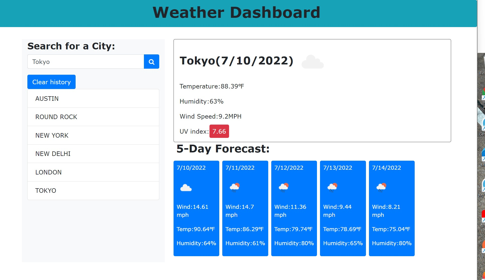

# weather-dashboard

1. Created folder structure and pushed the code to unique repo "weather-dashboard" https://github.com/ashwinilh/weather-dashboard
2. Hosted the repo "javascriptquiz" on github live website with the URL-  https://ashwinilh.github.io/weather-dashboard/ 
3. This repo is for challenge 6 of UT boot camp to create the weather outlook for multiple cities
4.Created basic html and css file.
5.Generated API keys.
6. Wrote Javascript code.

